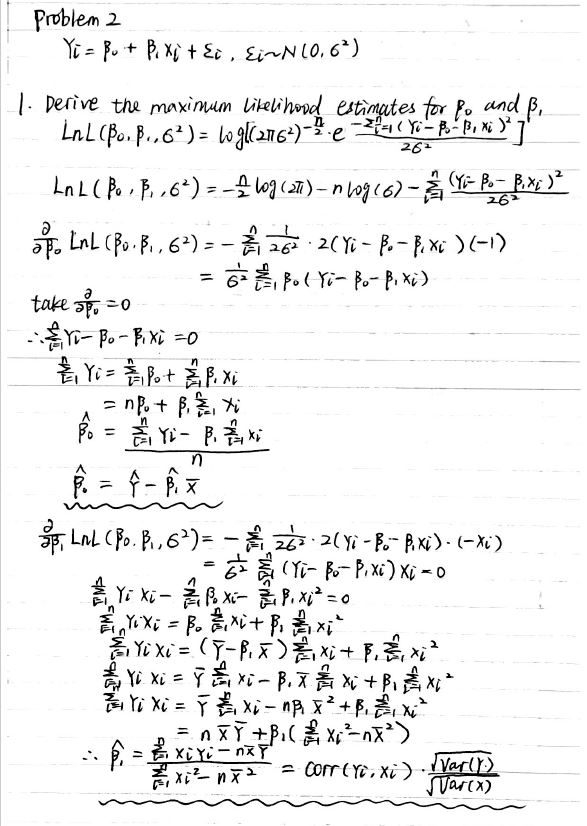
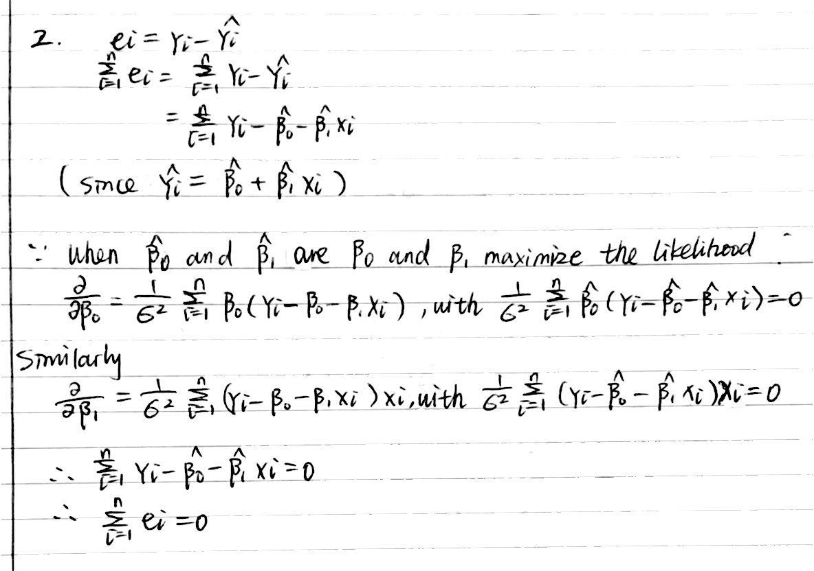
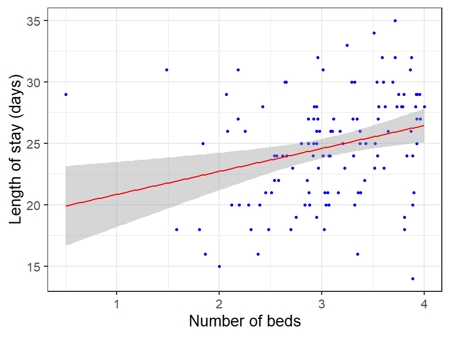

p8130\_hw5\_ys3394
================
Yifan Su
11/16/2020

## Problem 1

#### *Use a non-parametric test to assess and comment on the difference in Ig-M levels between the two groups (please ignore unanswered and missing values).*

``` r
antibodies = read_csv("./data/Antibodies.csv") %>% 
  janitor::clean_names() %>% 
  filter(!c(smell %in% c("Unanswered/Others"))) %>% 
  drop_na() %>% 
  pivot_wider(
      names_from = "smell",
      values_from = "antibody_ig_m"
    ) %>% 
  dplyr::select(Normal,Altered)


test_antibodies = wilcox.test(antibodies %>% pull(Normal), antibodies %>% pull(Altered), mu = 0)

test_antibodies
## 
##  Wilcoxon rank sum test with continuity correction
## 
## data:  antibodies %>% pull(Normal) and antibodies %>% pull(Altered)
## W = 5836, p-value = 0.01
## alternative hypothesis: true location shift is not equal to 0
```

  - The tidy dataset has two variables `Normal` and `Altered` in smell
    condition, with corresponding IgM measurements.

The measurements of IgM in two groups are independent, so we use the
**Wilcoxon Rank-Sum test** as a non parametric equivalent of the Two
Sample Independent t-test, with a significance level of 0.05.

**Assumption Checking**

\(n1~and~n2\geq10\), Under Normal-Approximation, satified.

**Hypothesis**

H0 : The medians of IgM level in Normal smell group and the Altered
smell group are equal.

H1 : The medians of IgM level in Normal smell group and the Altered
smell group are not equal.

**Decision Rule**

if no tied, the test statistic is:
\(T = \frac{|T_1 - n_1(n_1+n_2+1)/2|-\frac{1}{2}}{\sqrt{(n_1n_2/12)(n_1+n_2+1)}}\)
<br/> if ties, the test statistic is:
\(T = \frac{|T_1 - n_1(n_1+n_2+1)/2|-\frac{1}{2}}{\sqrt{(n_1n_2/12)[(n_1+n_2+1) - \sum^{g}_{i=1}t_i(t_i^2-1)/(n_1+n_2)(n_1+n_2+1)]}}\)

Reject H0 if \(T>z_{1-\alpha/2}\)

Fail to reject H0, otherwise.

p−value = \(2 ×[1- \Phi(T)]\)

**Conclusion**

| statistic | p.value | method                                            | alternative |
| --------: | ------: | :------------------------------------------------ | :---------- |
|      5836 |   0.014 | Wilcoxon rank sum test with continuity correction | two.sided   |

Since the p-value 0.014, we **reject the H0**, and conclude that The
medians of IgM level in Normal smell group and the Altered smell group
are not equal.

## Problem 2

#### *Derive the maximum likelihood estimates for 𝛽0 and 𝛽1,and show that the sum of the residuals is zero.*




## Problem 2

#### *Generate a scatter plot and test whether a linear association exists between student’s ACT score (X) and GPA at the end of the freshman year (Y). Use a level of significance of 0.05.*

``` r
gpa_df = read.csv("./data/GPA.csv")
reg_gpa = lm(gpa_df$GPA~gpa_df$ACT) # GPA as Y, ACT as X
summary(reg_gpa)
```

    ## 
    ## Call:
    ## lm(formula = gpa_df$GPA ~ gpa_df$ACT)
    ## 
    ## Residuals:
    ##     Min      1Q  Median      3Q     Max 
    ## -2.7400 -0.3383  0.0406  0.4406  1.2274 
    ## 
    ## Coefficients:
    ##             Estimate Std. Error t value Pr(>|t|)    
    ## (Intercept)   2.1140     0.3209    6.59  1.3e-09 ***
    ## gpa_df$ACT    0.0388     0.0128    3.04   0.0029 ** 
    ## ---
    ## Signif. codes:  0 '***' 0.001 '**' 0.01 '*' 0.05 '.' 0.1 ' ' 1
    ## 
    ## Residual standard error: 0.623 on 118 degrees of freedom
    ## Multiple R-squared:  0.0726, Adjusted R-squared:  0.0648 
    ## F-statistic: 9.24 on 1 and 118 DF,  p-value: 0.00292

``` r
qt(0.975, 118)
```

    ## [1] 1.98

We want to test whether a linear association exists between student’s
ACT score and GPA at the end of the freshman year, so we make an
**inference on the true regression slope**, with a level of significance
of 0.05.

**Hypothesis**

\(H0:\beta_{1}=\beta_{10}\)

\(H1:\beta_{1}\neq\beta_{10}~(\beta_{10}=0)\)

**Decision Rule**

The test statistic is:<br/>
\(t_{stats} = \frac{\hat{\beta_{1}}-\beta_{10}}{se(\hat{\beta_{1}})} = \frac{0.039-0}{0.013}\)
= 3.04

\(t_{n-2,1-\alpha/2} = t_{118,0.975}\) = 1.98

Reject H0 if \(|t|>t_{n-2,1-\alpha/2}\) Fail to reject H0, otherwise.

**Conclusion**

Since \(t_{stats} = 3.04>t_{118,0.975}= 1.98\) , **we reject the H0**
and conclude that \(\beta_{1}\neq\beta_{10}~(\beta_{10}=0)\), there is a
significant linear association between student’s ACT score and GPA at
the end of the freshman year.

#### *Write the estimated regression line equation in the context of this problem.*

| term        | estimate | std.error | statistic | p.value |
| :---------- | -------: | --------: | --------: | ------: |
| (Intercept) |    2.114 |     0.321 |      6.59 |   0.000 |
| gpa\_df$ACT |    0.039 |     0.013 |      3.04 |   0.003 |

The estimate slope is 0.039, estimate intercept is 2.114.

\(\hat{GPA}=2.114+0.039*ACT\)

#### *Obtain a 95% confidence interval for β1. Interpret your confidence interval. Does it include zero? Why might the director of admissions be interested in whether the confidence interval includes zero?*

A 95% confidence interval for the true slope is given by

\(\hat{\beta_{1}}\pm t_{n-2,1-\alpha/2}*se(\hat{\beta_{1}})\)

where \(se(\hat{\beta_{1}})=\sqrt{MSE/\sum_{i=1}^{n}(X_{i}-\bar{X})^2}\)

``` r
confint(reg_gpa,level=0.95)
```

    ##              2.5 % 97.5 %
    ## (Intercept) 1.4786 2.7495
    ## gpa_df$ACT  0.0135 0.0641

Thus, the 95% confidence interval for the true slope is ***(0.0135,
0.0641)***.

``` r
gpa_df =
  read.csv("./data/GPA.csv")

gpa_df %>% 
  ggplot(aes(GPA, ACT)) + 
  geom_point(color='blue') + 
  theme_bw(base_size=20) +
  geom_smooth(method='lm', se=TRUE, color='red') +
  labs(x="Number of beds", y="Length of stay (days)")
```

<!-- -->
